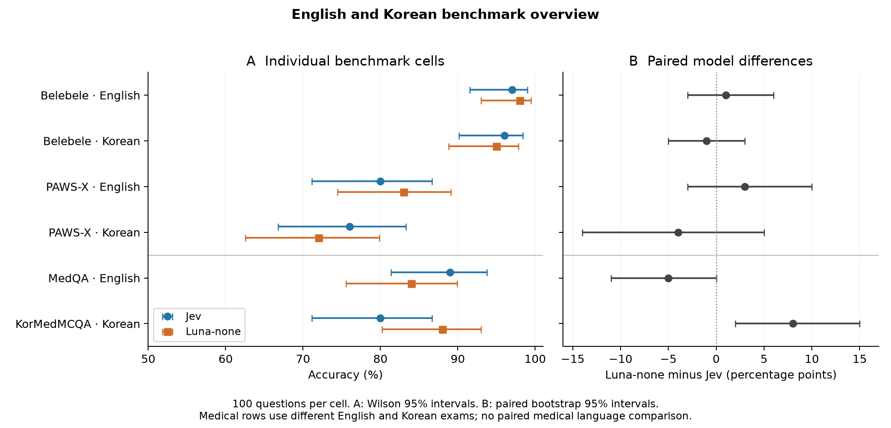
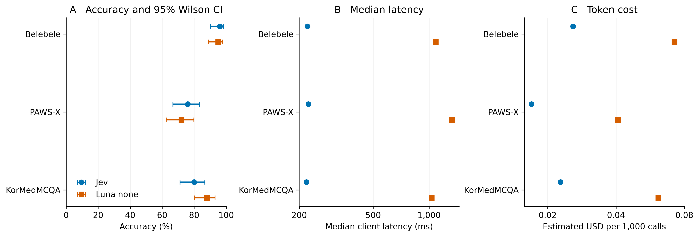
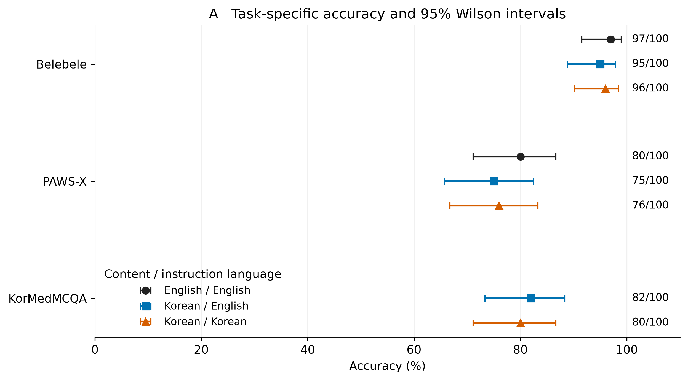
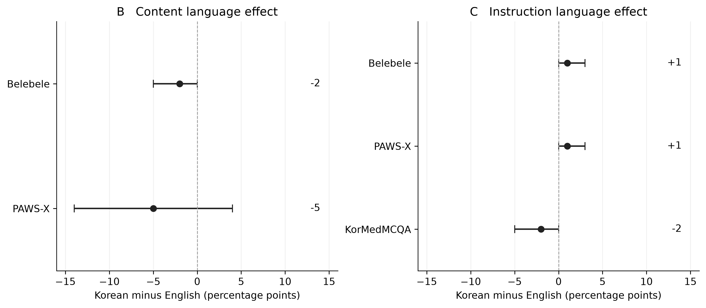
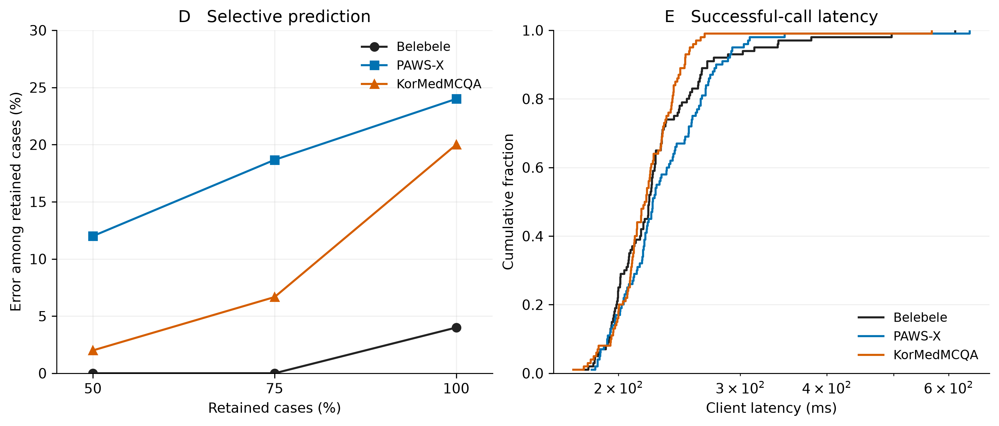

# Jev Korean and medical evaluation

<!-- aggregate-summary-start -->
## English/Korean × Jev/Luna-none

| Task | Language | Jev | Luna-none | Luna − Jev, pp (95% CI) |
|---|---|---:|---:|---:|
| Belebele | English | 97/100 | 98/100 | +1 (-3, +6) |
| Belebele | Korean | 96/100 | 95/100 | -1 (-5, +3) |
| PAWS-X | English | 80/100 | 83/100 | +3 (-3, +10) |
| PAWS-X | Korean | 76/100 | 72/100 | -4 (-14, +5) |
| MedQA | English | 89/100 | 84/100 | -5 (-11, +0) |
| KorMedMCQA | Korean | 80/100 | 88/100 | +8 (+2, +15) |

The equal-weight six-cell descriptive average is **Jev 86.33% and Luna-none 86.67%**. Luna minus Jev is +0.33 percentage points (exploratory cluster-bootstrap 95% interval -2.83 to +3.17). This summarizes this chosen battery, not general model ability or a medical language effect.

Restricting the average to matched Belebele and PAWS-X gives Jev 87.25% and Luna-none 87.00%, a difference of -0.25 points (95% interval -4.25 to +3.75).



Each cell has 100 questions. The general tasks are bilingual matched items; the medical rows are different exams. Error bars show 95% intervals. Timing remains separated by concurrency protocol.

[Detailed aggregate methods and results](https://ahn-lab.org/jev-korean-benchmark/aggregate.html) · [Reproducible data](results/aggregate/summary.json)
<!-- aggregate-summary-end -->

A small, reproducible early-access evaluation of TypeSafe Jev. English reporting with a Korean supplement. The experiment measures general Korean understanding, Korean medical examination knowledge, and exploratory interpretation of synthetic medical notes separately.

The scored public tasks use 100 Belebele questions, 100 PAWS-X pairs and 100 KorMedMCQA doctor questions. There are 36 development calls, 120 exploratory synthetic medical calls and 80 robustness calls, for 1,036 planned calls overall. These are repeated conditions on 340 scored source cases, not 1,036 independent questions.

<!-- medqa-summary-start -->
## Original-English medical QA

On 100 original-English MedQA test questions, **Jev scored 89% and Luna-none 84%**. Luna minus Jev was -5 percentage points (paired 95% interval -11 to +0). These are different questions from the Korean medical benchmark and cannot isolate a language effect.


**Figure.** One hundred matched questions per model. Accuracy bars show Wilson 95% intervals. Latency and cost are point estimates under four concurrent requests per provider. Parallel batch time is not comparable with the earlier sequential timings.

[Full English MedQA report](https://ahn-lab.org/jev-korean-benchmark/medqa-english.html) · [Frozen evidence](results/medqa-english-v3/)
<!-- medqa-summary-end -->
<!-- luna-summary-start -->
## Luna-none comparison

Luna was tested on the same 1,036 conditions with reasoning effort `none` and decision-only structured output. The table shows Korean content with Korean instructions, 100 cases per task.

| Task | Jev | Luna none | Luna minus Jev, pp (95% paired interval) |
|---|---:|---:|---:|
| Belebele | 96% | 95% | -1 (-5, +3) |
| PAWS-X | 76% | 72% | -4 (-14, +5) |
| KorMedMCQA | 80% | 88% | +8 (+2, +15) |



**Comparison figure.** Matched Korean-instruction cases. Accuracy bars are 95% Wilson intervals. Latency and cost use logarithmic axes and have no uncertainty intervals. Cost per 1,000 calls is a scaling of observed token charges, not a separate 1,000-call experiment. Different execution times and provider transports limit causal speed comparisons.

Across all stages, Luna used **$0.05337** in estimated API charges and **1543.6 seconds** of summed API attempt time. Successful-call median / p95 latency was **1110 / 3113 ms**. Jev's corresponding figures were $0.02056, 262.0 seconds and 221 / 306 ms. These are observed service measurements, not guaranteed performance. No higher-reasoning Luna condition has been run.

[Full comparison report](https://ahn-lab.org/jev-korean-benchmark/luna-comparison.html) · [Recorded Luna evidence](results/luna-none-v1/) · [Design and existing comparisons](docs/comparison-design.md) · [Medical benchmark context infographic](docs/kormedmcqa-context.md)

The original Jev-only findings follow. Synthetic medical results remain unreviewed and exploratory.
<!-- luna-summary-end -->
## Read the findings

### Results at a glance

| Task | Cases | English / English | Korean / English | Korean / Korean |
|---|---:|---:|---:|---:|
| Belebele reading | 100 | 97% | 95% | 96% |
| PAWS-X equivalence | 100 | 80% | 75% | 76% |
| KorMedMCQA doctor examination | 100 | Not tested | 82% | 80% |

Conditions denote content / instruction language. No overall score is pooled. The medical examination has no matched English arm. Synthetic medical probes achieved 40/40 in each condition but remain unreviewed and are excluded from the primary medical score.



**Figure 1.** Points are observed accuracy and bars are 95% Wilson intervals, with 100 cases per point. Conditions reuse the same cases, so interval overlap is not a test of paired differences. Missing English medical results were not evaluated.



**Figure 2.** Paired differences with 95% percentile bootstrap intervals, 4,000 resamples and seed 20260917. Content effects hold English instructions fixed. Instruction effects hold Korean content fixed. Positive values favor Korean. These small-sample, unadjusted intervals are descriptive and do not establish equivalence.



**Figure 3.** Korean-instruction conditions, 100 cases per task. Left, observed error at three prespecified coverage levels, with connecting lines as visual guides. Cases are ranked by Choice confidence or Noul distance from 0.5, with ties broken by evaluation ID. Right, empirical cumulative distributions of successful-call latency on a logarithmic axis. Network and SDK decoding are included. Failed attempts and development calls are excluded from this panel.

Across the whole pilot, estimated API cost was **$0.02056**, summed API attempt duration **262 seconds**, and successful-call median / p95 latency **221 / 306 ms**. Cost is based on reported usage, not an invoice. Total runner timing omits the first ten development calls. Reversing sentence order changed 3/5 PAWS-X predictions in a small prespecified robustness subset, which does not estimate a population flip rate.

Download [vector figures and PDFs](docs/figures/). Rebuild figures without API calls using `python -m jevbench.figures`. Detailed methods, probability-normalization amendment, exclusions, metrics and individual errors are linked below.

- [Existing Jev comparisons and proposed Luna-none extension](docs/comparison-design.md)

- [Live web report](https://ahn-lab.org/jev-korean-benchmark/)
- [English report](docs/report.md)
- [Korean supplement](docs/korean-supplement.md)
- [Methodology](docs/methodology.md)
- [Recorded outputs and frozen source metadata](results/)

## Install

Tested with Python 3.14.2 on Windows. Python 3.10 or newer is required by the SDK. Offline analysis and preparation are portable. Live runs currently use a Windows advisory process lock.

```powershell
uv venv .venv
uv pip install --python .venv/Scripts/python.exe -r requirements.txt
.venv/Scripts/python.exe -X utf8 -m pytest -q
```

For live calls, put a `TYPESAFE_API_KEY` or `TYPESAFE_KEY` assignment in local `typesafe.env`. This file is ignored by Git. Never commit credentials. The live runner reads this file directly, disables SDK retries, and implements two logged retries of transient failures itself.

## Commands

The original-English MedQA extension uses 100 frozen questions and four concurrent requests per provider. Reconstruct its inputs and restore the published results without model calls using these commands.

```powershell
.venv/Scripts/python.exe -X utf8 -m jevbench.medqa_prepare
.venv/Scripts/python.exe -X utf8 -m jevbench.medqa_publish --restore
```

Its live runner is `python -m jevbench.medqa_run`, with `--limit 10` for the initial usage check and successful calls preserved on resume. The completed experiment is immutable. New inference or changed settings requires a new experiment. Generate its report with `python -m jevbench.medqa_publish`.

The separate Luna comparison runner uses an `OPENAI_API_KEY` assignment in the same ignored `typesafe.env`. Its fixed experiment is `luna-none-v1`, with explicit reasoning effort `none`, decision-only structured output, sequential requests and a $0.25 estimated-cost ceiling. Successful requests are preserved on resume. Run stages in order and inspect each generated stage report before continuing.

```powershell
# Rebuild the original Jev inputs first with the prepare command below.
.venv/Scripts/python.exe -X utf8 -m jevbench.luna prepare
.venv/Scripts/python.exe -X utf8 -m jevbench.luna run --stage 0 --limit 10
# Inspect usage, then finish Stage 0 and run Stages 1 through 4 separately.
.venv/Scripts/python.exe -X utf8 -m jevbench.luna run --stage 0
.venv/Scripts/python.exe -X utf8 -m jevbench.luna run --stage 1
```

After downloading published Luna evidence, `python -m jevbench.luna restore` reconstructs its local response records and reports without API calls. The frozen Luna runner is for reproducing this specific experiment. Changing reasoning, prompts, output format or source cases requires a new experiment rather than editing or rerunning completed records.

```powershell
# Download pinned sources and reconstruct the exact manifest. No API calls.
.venv/Scripts/python.exe -X utf8 -m jevbench prepare

# Import the published responses and reproduce reports. No model calls.
.venv/Scripts/python.exe -X utf8 -m jevbench restore
.venv/Scripts/python.exe -X utf8 -m jevbench report

# Make a NEW experiment for new inference; never overwrite the recorded pilot.
.venv/Scripts/python.exe -X utf8 -m jevbench prepare --experiment replication-01 --model jev-1.13.0
.venv/Scripts/python.exe -X utf8 -m jevbench run --experiment replication-01 --stage 0
.venv/Scripts/python.exe -X utf8 -m jevbench run --experiment replication-01 --stage 1
```

Before Stage 2, inspect the generated `medical_input_audit.md` and record a `medical_input_review.json` alongside the manifest. It must contain the manifest's SHA-256 in `manifest_hash`, `all_selected_text_complete: true`, the reviewer, date, scope and any caveats. This is an input-completeness audit, not a clinical correctness endorsement. Do not mark it complete without checking all selected inputs.

```powershell
.venv/Scripts/python.exe -X utf8 -m jevbench run --experiment replication-01 --stage 2
.venv/Scripts/python.exe -X utf8 -m jevbench run --experiment replication-01 --stage 3
.venv/Scripts/python.exe -X utf8 -m jevbench run --experiment replication-01 --stage 4
.venv/Scripts/python.exe -X utf8 -m jevbench report --experiment replication-01
```

Successful or terminally failed evaluations are never called again by resume. An intent without a corresponding outcome is treated as uncertain and stops the runner. Fatal validation/API failures require inspection and a new experiment. The published-price budget ceiling is $0.25 per experiment and is conservative for failed calls; it is not an account-side spending limit.

The 40 authored medical cases have not been reviewed by a clinician. Their proposed labels and translations are available in the generated review packet and [source file](jevbench/synthetic.py). They must not be presented as a validated clinical benchmark. Preserve the original results when adding review or correcting cases.

## Provenance and licensing

- Belebele, Bandarkar et al., ACL 2024. [Repository](https://github.com/facebookresearch/belebele). CC BY-SA 4.0.
- PAWS-X, Yang et al., EMNLP 2019. [Repository](https://github.com/google-research-datasets/paws/tree/master/pawsx). Consult the upstream Google PAWS license.
- KorMedMCQA, Kweon et al., 2024. [Dataset](https://huggingface.co/datasets/sean0042/KorMedMCQA). CC BY-NC 2.0.

This repository distributes code, experiment metadata and model outputs. Public benchmark passage/question text is retrieved from upstream sources during preparation and is not bundled in the published results. Source dataset licenses continue to apply to downloaded inputs. Historical exam gold answers are not updated to current medical or legal guidance.

The service was accessed through an early-access account. Model version, access date and measured token charges are disclosed in the report. Public benchmark training exposure is unknown. No other model was run in this pilot, and no speed or accuracy superiority over other models is claimed.
