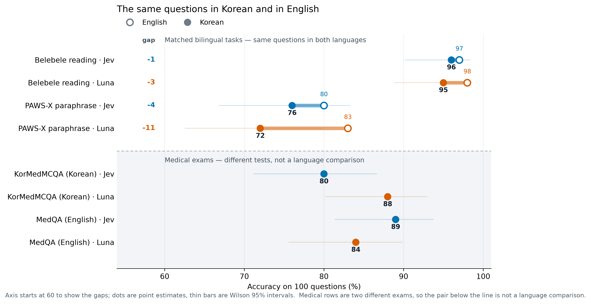
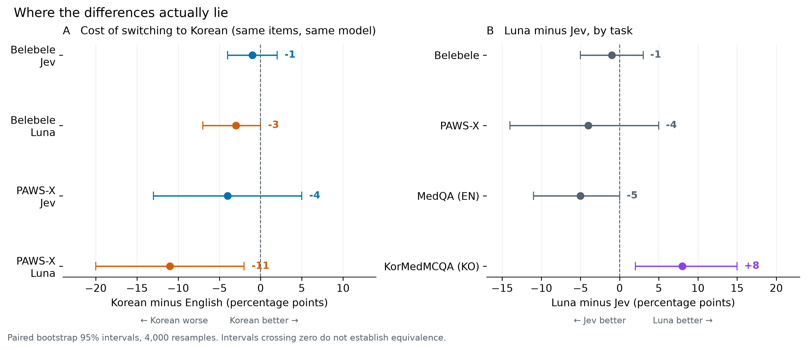
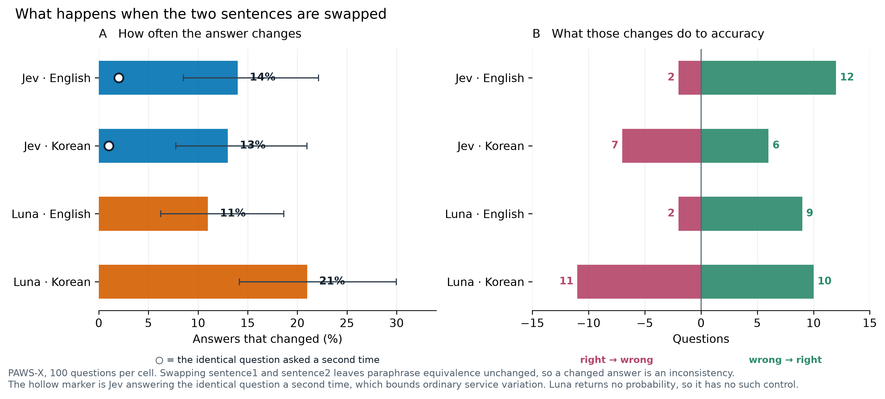
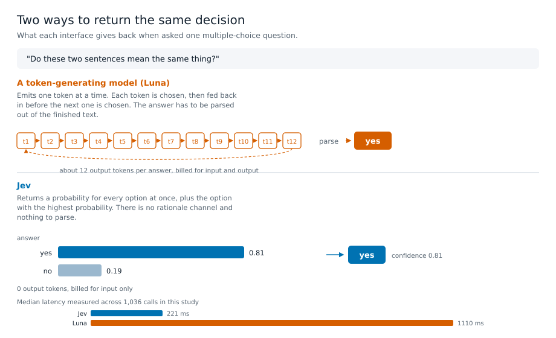
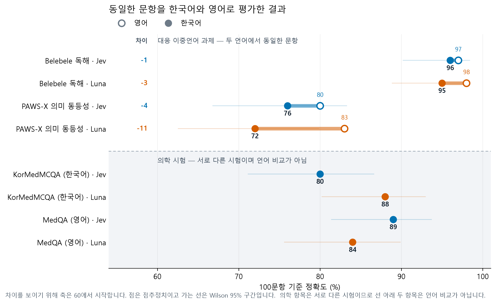
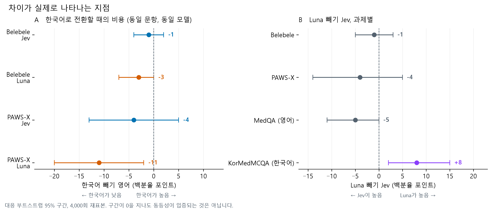
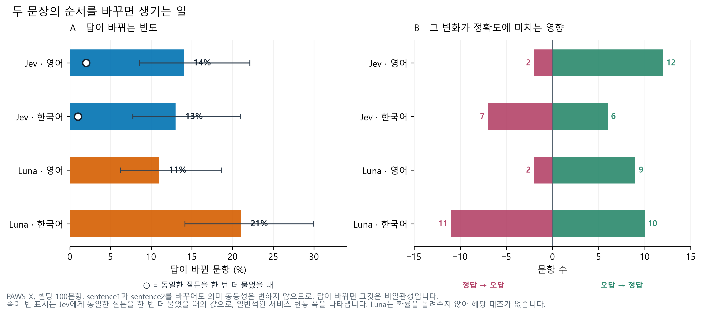
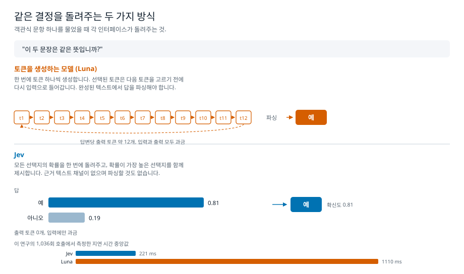

# Jev in Korean: a 100-question sample check

Can you use TypeSafe Jev on Korean text, or should you translate to English first? This page reports a small, frozen, reproducible check of that question: 100 questions per cell drawn from four public test sets, with every response recorded and every figure rebuildable without an API call.

It is a sample check, not a benchmark. One hundred questions carry roughly ±8 points of uncertainty, so small differences here are not findings. Exactly one difference in the whole study survives its own uncertainty, and it is flagged where it appears.

## Short answer

- **Korean reading comprehension is fine.** 96 of 100 in Korean against 97 in English, on the same questions.
- **Fine-grained meaning judgements are shaky in both languages.** 76 in Korean, 80 in English. This is the weak task regardless of language.
- **Don't write your prompts in English.** Korean content scored within a point or two whichever language the instructions were in.
- **The two medical numbers cannot be compared to each other.** They are different exams. See [About the medical numbers](#about-the-medical-numbers).
- **Jev tells you when it is unsure, and that is worth a lot.** On Korean medical questions, taking only its most confident half cuts the error rate from 20% to 2%.

## Results

| Task | Language | Jev | Luna | Luna − Jev (95% CI) |
|---|---|---:|---:|---:|
| Belebele reading | English | 97/100 | 98/100 | +1 (−3, +6) |
| Belebele reading | Korean | 96/100 | 95/100 | −1 (−5, +3) |
| PAWS-X paraphrase | English | 80/100 | 83/100 | +3 (−3, +10) |
| PAWS-X paraphrase | Korean | 76/100 | 72/100 | −4 (−14, +5) |
| MedQA exam | English | 89/100 | 84/100 | −5 (−11, +0) |
| KorMedMCQA exam | Korean | 80/100 | 88/100 | **+8 (+2, +15)** |

Belebele and PAWS-X are the same questions professionally translated, so those rows isolate language. The two medical sets are unrelated exams. Luna is `gpt-5.6-luna` at reasoning effort `none`.

### Does the instruction language matter?

Holding the content in Korean and changing only the instruction language:

| Task (Korean content) | Jev, English instructions | Jev, Korean instructions | Luna, English | Luna, Korean |
|---|---:|---:|---:|---:|
| Belebele | 95 | 96 | 93 | 95 |
| PAWS-X | 75 | 76 | 76 | 72 |
| KorMedMCQA | 82 | 80 | 89 | 88 |

Every difference is within a few points with no consistent direction. There is no evidence here that writing your instructions in English helps.

**Panel A** is the cost of switching to Korean on identical questions. Luna loses 11 points on PAWS-X with an interval that excludes zero; Jev loses 4 with an interval that includes it. **Panel B** is the model gap per task.

<!-- examples-start -->
## What the questions actually look like

One real item per source, chosen at random from questions this study did **not** score. Seeing the format explains a lot about what the numbers mean.

### Belebele — reading comprehension, same item in both languages

**English** · Passage

> For some festivals, the vast majority of the attendants to music festivals decide to camp on site, and most attendants consider it a vital part of the experience. If you want to be close to the action you're going to have to get in early to get a camping site close to the music. Remember that even though music on the main stages may have finished, there may be sections of the festival that will keep playing music until late into the night. Some festivals have special camping areas for families with young children.

Question: What aspect of music festivals do some attendants consider to be a crucial part of the experience?

| | Options |
|---|---|
| **1** | Bringing young children |
| **2** | Camping on site ✅ |
| **3** | Music playing late into the night |
| **4** | Getting in early |

**Korean** · Passage

> 몇몇 축제들에서 음악 축제에 참석하는 많은 사람들이 그 자리에서 야영하기로 결정하고, 대부분의 참석자는 야영을 반드시 경험해봐야 하는 일이라 생각한다. 즐거움과 활기를 가까이하려면 일찍 들어가야 음악과 가까운 곳에 캠핑장을 구할 수 있다. 비록 중앙 무대에서 연주하는 곡은 끝날 수 있지만, 축제 곳곳에서는 밤늦게까지 음악을 연주할 수도 있다는 것을 잊지 마세요. 일부 축제들은 어린아이들이 있는 가족들을 위한 특별한 캠핑 공간을 가지고 있습니다.

Question: 일부 참석자들은 음악 축제의 어떤 측면을 경험의 중요한 부분으로 생각합니까?

| | Options |
|---|---|
| **1** | 어린아이 동반 |
| **2** | 야영 ✅ |
| **3** | 밤늦게까지 음악 연주 |
| **4** | 일찍 들어가기 |

Belebele, Bandarkar et al., ACL 2024, CC BY-SA 4.0

### PAWS-X — do these two sentences mean the same thing?

| | English | Korean |
|---|---|---|
| **Sentence 1** | Sulz is a municipality in the district of Vorarlberg in the Austrian province of Feldkirch . | 슐츠는 오스트리아 펠트크릭에 소재한 포르알베르크 구의 지방자치단체이다. |
| **Sentence 2** | Sulz is a municipality in the district of Feldkirch in the Austrian state of Vorarlberg . | 줄츠(Sulz)는 오스트리아의 포르알베르크(Vorarlberg) 주의 펠트키르히(Feldkirch) 지구에 있는 지자체입니다. |

Gold label: **not equivalent**

PAWS-X, Yang et al., EMNLP 2019. Data source: Google LLC

### KorMedMCQA — Korean medical licensing exam

> 17세 여자가 초경을 하지 않아서 병원에 왔다. 유방 발달은 태너기 Ⅳ, 음모 발달은 태너기 I이다. 골반검사에서 질은 맹관으로 막혀 있고, 골반초음파검사에서 자궁은 보이지 않는다. 검사는?

| | Options |
|---|---|
| **1** | FMR1 유전자검사 |
| **2** | 염색체 핵형검사 ✅ |
| **3** | 골밀도검사 |
| **4** | 뇌 자기공명영상 |
| **5** | 진단복강경술 |

KorMedMCQA, Kweon et al., 2024, CC BY-NC 2.0

### MedQA — United States medical licensing exam

> A 29-year-old woman presents to the clinic after several months of weight loss. She noticed a 6.8 kg (15 lb) unintentional weight loss over the preceding several months. She has not changed her diet or exercise habits. She also reports feuding with her boyfriend over the temperature of their shared apartment, as she always feels warmer than he does. The vital signs include: heart rate 110/min and blood pressure 146/78 mm Hg. The physical exam is notable for warm and slightly moist skin. She also exhibits a fine tremor in her hands when her arms are outstretched. The urine pregnancy test is negative. Which of the following is the best single treatment option for this patient?

| | Options |
|---|---|
| **A** | Glucocorticoids |
| **B** | Methimazole ✅ |
| **C** | Propranolol |
| **D** | Radioiodine therapy |

MedQA, Jin et al., 2020, MIT License

Items are shown exactly as distributed upstream, including original spelling. None of these four is among the 100 scored questions for its task.
<!-- examples-end -->

## About the medical numbers

MedQA-English is 89 and KorMedMCQA-Korean is 80. **This is not evidence that Jev is worse at medicine in Korean.** They are two different examinations with different authorities, difficulty and subject mixes. This check has no matched English medical arm, so it cannot separate "harder exam" from "harder language". Do not subtract the two.

What the medical rows do support is a model comparison on the same exam, and there Jev trails: 80 against Luna's 88, a gap of +8 points (95% interval +2 to +15). That is the one result here that clears its own uncertainty, and it does not favour Jev.

A full 435-question study of KorMedMCQA with additional comparators is being published separately. The 100-question figure here is a first look, not that study's result.

## When Jev knows it is unsure

Because Jev returns a probability for every option, you can ask what happens if you only accept answers it is confident about. Ranking Korean answers by returned confidence and keeping the most confident half:

| Korean task (Jev) | Error, all 100 | Error, most confident 50 |
|---|---:|---:|
| Belebele reading | 4% | 0% |
| PAWS-X paraphrase | 24% | 12% |
| KorMedMCQA exam | 20% | **2%** |

On the medical exam the confidence signal is strongly informative: the errors concentrate in the answers Jev is least sure about. On PAWS-X it helps much less — Jev is confidently wrong there more often, which fits the accuracy being mediocre in both languages.

This is descriptive, not a deployment threshold. Confidence is not the probability of being correct, and these are 100-question estimates. But it is a capability Luna does not have in this protocol at all: a decision-only response cannot be ranked this way.

## Does the order of your input matter?

Somewhat, and equally in both languages. Swapping the two sentences in a PAWS-X question does not change the correct answer, so any changed answer is an inconsistency.

Jev changes its answer on 13% of Korean questions and 14% of English ones. Asking Jev the *identical* question a second time changes 1–2%, so most of that is the reordering rather than ordinary service variation.

In English the changes are lopsided towards the right answer — 12 wrong→right against 2 right→wrong — so one orientation is simply easier, and reversal raises English accuracy about 10 points. In Korean they are a coin toss (6 versus 7), changing answers without improving them.

> An earlier version of this study reported a far more alarming figure based on 5 questions. At 100 questions the rate is 13%, not 60%. The original 5 still behave the same way; they were an unlucky draw. It is a good illustration of why nothing here should be read as precise.

## How Jev answers differently

Ask a conventional model a multiple-choice question and it writes an answer one token at a time, each token feeding back in before the next is chosen; you parse the answer out of the finished text. Ask Jev and it returns a probability for every option at once, plus the highest-scoring option. There is no reasoning text and nothing to parse.

- **Speed.** 221 ms median against Luna's 1110 ms; p95 306 ms against 3113 ms.
- **Price.** Jev is billed on input only and produces no output tokens. Across the full pilot Jev cost $0.02056 against Luna's $0.05337 for the same 1,036 conditions.
- **What you can measure.** The probabilities are what make the coverage table above possible.

This describes what each interface returns. It is not a claim about how either model works internally.

## What this cannot tell you

- **Whether these numbers generalise.** 100 questions per cell, one run, one account, one day. Intervals are wide and unadjusted for multiple comparisons.
- **Whether the models had seen these questions.** All four sets are public; training exposure is unknown for both.
- **Anything about medical language specifically.** No matched English/Korean medical pair exists here.
- **Anything about longer or generative tasks.** Every question is a single decision with no conversation, retrieval or tools.
- **Exact reproducibility.** Re-running identical requests against the same model version changed about 2% of answers.

## Details and data

- [Methodology](methodology.html) — sampling, statistics, exclusions, the probability-normalisation amendment
- [Running the experiments](running-experiments.html)
- [Clinician review packet](clinician-review.html) — the 40 authored synthetic medical cases, unreviewed and excluded from the medical score
- [Download recorded results](results.zip)
- [Code and data on GitHub](https://github.com/mahlernim/jev-korean-benchmark)

<!-- lang:ko -->

# Jev의 한국어 성능: 100문항 표본 점검

TypeSafe Jev를 한국어 텍스트에 그대로 써도 될까요, 아니면 영어로 번역해서 써야 할까요? 이 페이지는 그 질문에 대한 작고 고정된 재현 가능한 점검 결과입니다. 공개 테스트 세트 네 곳에서 셀당 100문항씩 평가했고, 모든 응답을 기록했으며, 모든 그림은 API 호출 없이 다시 생성할 수 있습니다.

이것은 벤치마크가 아니라 표본 점검입니다. 100문항은 약 ±8포인트의 불확실성을 가지므로 여기서 작은 차이는 발견이 아닙니다. 연구 전체에서 자체 불확실성을 넘어서는 차이는 단 하나이며, 해당 위치에 표시해 두었습니다.

## 요약

- **한국어 독해는 문제없습니다.** 동일 문항에서 한국어 96점, 영어 97점입니다.
- **세밀한 의미 판단은 두 언어 모두 불안정합니다.** 한국어 76점, 영어 80점으로, 언어와 무관하게 취약한 과제입니다.
- **지시문을 영어로 쓰지 마십시오.** 한국어 내용에 대해 지시문 언어와 관계없이 점수 차이는 1~2점 안이었습니다.
- **두 의학 점수는 서로 비교할 수 없습니다.** 서로 다른 시험입니다. [의학 점수에 대하여](#의학-점수에-대하여)를 참고하세요.
- **Jev는 확신이 없을 때 그것을 알려주며, 이 점의 가치가 큽니다.** 한국어 의학 문항에서 확신도가 높은 절반만 취하면 오류율이 20%에서 2%로 떨어집니다.

## 결과

| 과제 | 언어 | Jev | Luna | Luna − Jev (95% 구간) |
|---|---|---:|---:|---:|
| Belebele 독해 | 영어 | 97/100 | 98/100 | +1 (−3, +6) |
| Belebele 독해 | 한국어 | 96/100 | 95/100 | −1 (−5, +3) |
| PAWS-X 의미 동등성 | 영어 | 80/100 | 83/100 | +3 (−3, +10) |
| PAWS-X 의미 동등성 | 한국어 | 76/100 | 72/100 | −4 (−14, +5) |
| MedQA 시험 | 영어 | 89/100 | 84/100 | −5 (−11, +0) |
| KorMedMCQA 시험 | 한국어 | 80/100 | 88/100 | **+8 (+2, +15)** |

Belebele과 PAWS-X는 동일한 문항을 전문 번역한 것이므로 이 항목들은 언어 효과를 분리해 줍니다. 두 의학 세트는 서로 관계없는 시험입니다. Luna는 추론 강도 `none`으로 설정한 `gpt-5.6-luna`입니다.

### 지시문 언어가 중요한가

내용은 한국어로 고정하고 지시문 언어만 바꾼 결과입니다.

| 과제 (한국어 내용) | Jev, 영어 지시문 | Jev, 한국어 지시문 | Luna, 영어 | Luna, 한국어 |
|---|---:|---:|---:|---:|
| Belebele | 95 | 96 | 93 | 95 |
| PAWS-X | 75 | 76 | 76 | 72 |
| KorMedMCQA | 82 | 80 | 89 | 88 |

모든 차이가 몇 점 이내이며 일관된 방향이 없습니다. 지시문을 영어로 쓰는 것이 도움이 된다는 근거는 여기에 없습니다.

**패널 A**는 동일 문항에서 한국어로 전환할 때의 비용입니다. Luna는 PAWS-X에서 11점을 잃으며 구간이 0을 포함하지 않습니다. Jev는 4점을 잃고 구간이 0을 포함합니다. **패널 B**는 과제별 모델 간 차이입니다.

<!-- examples-ko-start -->
## 실제 문항은 어떻게 생겼는가

출처별로 실제 문항 하나씩이며, 이 연구에서 채점하지 **않은** 문항 중에서 무작위로 골랐습니다. 형식을 보면 수치의 의미를 이해하는 데 큰 도움이 됩니다.

### Belebele — 독해, 두 언어의 동일 문항

**영어** · 지문

> For some festivals, the vast majority of the attendants to music festivals decide to camp on site, and most attendants consider it a vital part of the experience. If you want to be close to the action you're going to have to get in early to get a camping site close to the music. Remember that even though music on the main stages may have finished, there may be sections of the festival that will keep playing music until late into the night. Some festivals have special camping areas for families with young children.

문항: What aspect of music festivals do some attendants consider to be a crucial part of the experience?

| | 선택지 |
|---|---|
| **1** | Bringing young children |
| **2** | Camping on site ✅ |
| **3** | Music playing late into the night |
| **4** | Getting in early |

**한국어** · 지문

> 몇몇 축제들에서 음악 축제에 참석하는 많은 사람들이 그 자리에서 야영하기로 결정하고, 대부분의 참석자는 야영을 반드시 경험해봐야 하는 일이라 생각한다. 즐거움과 활기를 가까이하려면 일찍 들어가야 음악과 가까운 곳에 캠핑장을 구할 수 있다. 비록 중앙 무대에서 연주하는 곡은 끝날 수 있지만, 축제 곳곳에서는 밤늦게까지 음악을 연주할 수도 있다는 것을 잊지 마세요. 일부 축제들은 어린아이들이 있는 가족들을 위한 특별한 캠핑 공간을 가지고 있습니다.

문항: 일부 참석자들은 음악 축제의 어떤 측면을 경험의 중요한 부분으로 생각합니까?

| | 선택지 |
|---|---|
| **1** | 어린아이 동반 |
| **2** | 야영 ✅ |
| **3** | 밤늦게까지 음악 연주 |
| **4** | 일찍 들어가기 |

Belebele, Bandarkar et al., ACL 2024, CC BY-SA 4.0

### PAWS-X — 이 두 문장은 같은 뜻입니까?

| | 영어 | 한국어 |
|---|---|---|
| **문장 1** | Sulz is a municipality in the district of Vorarlberg in the Austrian province of Feldkirch . | 슐츠는 오스트리아 펠트크릭에 소재한 포르알베르크 구의 지방자치단체이다. |
| **문장 2** | Sulz is a municipality in the district of Feldkirch in the Austrian state of Vorarlberg . | 줄츠(Sulz)는 오스트리아의 포르알베르크(Vorarlberg) 주의 펠트키르히(Feldkirch) 지구에 있는 지자체입니다. |

정답 레이블: **동등하지 않음**

PAWS-X, Yang et al., EMNLP 2019. 데이터 출처: Google LLC

### KorMedMCQA — 한국 의사 국가시험

> 17세 여자가 초경을 하지 않아서 병원에 왔다. 유방 발달은 태너기 Ⅳ, 음모 발달은 태너기 I이다. 골반검사에서 질은 맹관으로 막혀 있고, 골반초음파검사에서 자궁은 보이지 않는다. 검사는?

| | 선택지 |
|---|---|
| **1** | FMR1 유전자검사 |
| **2** | 염색체 핵형검사 ✅ |
| **3** | 골밀도검사 |
| **4** | 뇌 자기공명영상 |
| **5** | 진단복강경술 |

KorMedMCQA, Kweon et al., 2024, CC BY-NC 2.0

### MedQA — 미국 의사 면허시험

> A 29-year-old woman presents to the clinic after several months of weight loss. She noticed a 6.8 kg (15 lb) unintentional weight loss over the preceding several months. She has not changed her diet or exercise habits. She also reports feuding with her boyfriend over the temperature of their shared apartment, as she always feels warmer than he does. The vital signs include: heart rate 110/min and blood pressure 146/78 mm Hg. The physical exam is notable for warm and slightly moist skin. She also exhibits a fine tremor in her hands when her arms are outstretched. The urine pregnancy test is negative. Which of the following is the best single treatment option for this patient?

| | 선택지 |
|---|---|
| **A** | Glucocorticoids |
| **B** | Methimazole ✅ |
| **C** | Propranolol |
| **D** | Radioiodine therapy |

MedQA, Jin et al., 2020, MIT License

문항은 원본 배포 형태 그대로이며 원문 표기를 유지합니다. 네 문항 모두 해당 과제의 채점된 100문항에 포함되지 않습니다.
<!-- examples-ko-end -->

## 의학 점수에 대하여

MedQA 영어가 89점, KorMedMCQA 한국어가 80점입니다. **이것은 Jev가 한국어 의학에서 더 나쁘다는 근거가 아닙니다.** 두 시험은 출제 기관, 난이도, 과목 구성이 모두 다릅니다. 이 점검에는 대응하는 영어 의학 항목이 없으므로 "더 어려운 시험"과 "더 어려운 언어"를 구분할 수 없습니다. 두 점수를 빼지 마십시오.

의학 항목이 뒷받침하는 것은 동일 시험에서의 모델 비교이며, 거기서 Jev는 뒤집니다. Luna 88점에 대해 80점으로 +8포인트 차이입니다(95% 구간 +2 ~ +15). 이 연구에서 자체 불확실성을 넘어서는 유일한 결과이며 Jev에게 유리하지 않습니다.

더 많은 비교 모델을 포함한 435문항 규모의 KorMedMCQA 연구는 별도로 발표될 예정입니다. 여기의 100문항 수치는 그 연구의 결과가 아니라 첫인상입니다.

## Jev가 확신이 없을 때

Jev는 모든 선택지의 확률을 돌려주므로, 확신하는 답만 받아들이면 어떻게 되는지 물을 수 있습니다. 한국어 응답을 확신도 순으로 정렬해 상위 절반만 남긴 결과입니다.

| 한국어 과제 (Jev) | 전체 100문항 오류율 | 확신도 상위 50문항 오류율 |
|---|---:|---:|
| Belebele 독해 | 4% | 0% |
| PAWS-X 의미 동등성 | 24% | 12% |
| KorMedMCQA 시험 | 20% | **2%** |

의학 시험에서는 확신도 신호가 매우 유용합니다. 오류가 Jev가 가장 확신하지 못한 답에 집중되어 있습니다. PAWS-X에서는 도움이 훨씬 적습니다. 확신하면서 틀리는 경우가 더 많으며, 이는 두 언어 모두에서 정확도가 낮은 것과 부합합니다.

이는 기술적 관찰이며 운영 임계값이 아닙니다. 확신도는 정답일 확률이 아니며, 100문항 기준의 추정치입니다. 다만 이 프로토콜에서 Luna에는 아예 없는 기능입니다. 결정만 돌려주는 응답은 이런 식으로 정렬할 수 없습니다.

## 입력 순서가 중요한가

어느 정도 그렇고, 두 언어에서 비슷합니다. PAWS-X 문항에서 두 문장의 순서를 바꾸어도 정답은 달라지지 않으므로, 답이 바뀌면 그것은 비일관성입니다.

Jev는 한국어 문항의 13%, 영어 문항의 14%에서 답을 바꿉니다. *동일한* 질문을 한 번 더 물었을 때는 1~2%만 바뀌므로, 대부분은 일반적인 서비스 변동이 아니라 순서 변경 때문입니다.

영어에서는 변화가 정답 쪽으로 치우쳐 있습니다. 오답에서 정답으로 12건, 정답에서 오답으로 2건이므로 한쪽 순서가 단순히 더 쉬우며, 순서를 뒤집으면 영어 정확도가 약 10점 오릅니다. 한국어에서는 동전 던지기에 가깝고(6건 대 7건) 답은 바뀌지만 나아지지 않습니다.

> 이 연구의 이전 판은 5문항에 근거해 훨씬 심각한 수치를 보고했습니다. 100문항에서는 60%가 아니라 13%입니다. 원래의 5문항은 지금도 같은 방식으로 동작하며 단지 운 나쁜 표본이었습니다. 여기의 어떤 수치도 정밀한 값으로 읽어서는 안 되는 이유를 잘 보여 줍니다.

## Jev의 응답 방식은 무엇이 다른가

일반적인 모델에 객관식 문항을 물으면 토큰을 하나씩 생성하며 답을 씁니다. 각 토큰은 다음 토큰을 고르기 전에 다시 입력으로 들어가고, 완성된 텍스트에서 답을 파싱해야 합니다. Jev에 물으면 모든 선택지의 확률을 한 번에 돌려주고 가장 높은 선택지를 함께 제시합니다. 근거 텍스트도 없고 파싱할 것도 없습니다.

- **속도.** 중앙값 221ms 대 Luna 1110ms, p95는 306ms 대 3113ms입니다.
- **비용.** Jev는 입력에만 과금되며 출력 토큰이 없습니다. 전체 파일럿에서 동일한 1,036개 조건에 대해 Jev는 $0.02056, Luna는 $0.05337이었습니다.
- **측정할 수 있는 것.** 위의 커버리지 표는 이 확률값이 있기에 가능합니다.

이는 각 인터페이스가 무엇을 돌려주는지에 대한 설명이며, 두 모델의 내부 동작에 대한 주장이 아닙니다.

## 이 문서가 답할 수 없는 것

- **이 수치가 일반화되는지.** 셀당 100문항, 1회 실행, 단일 계정, 하루 동안의 결과입니다. 구간은 넓고 다중 비교 보정을 하지 않았습니다.
- **모델이 이 문항들을 학습에서 보았는지.** 네 세트 모두 공개 자료이며 두 모델 모두 학습 노출 여부를 알 수 없습니다.
- **의학 언어에 대한 것.** 대응하는 영어/한국어 의학 쌍이 없습니다.
- **더 길거나 생성적인 과제에 대한 것.** 모든 문항이 대화, 검색, 도구가 없는 단일 결정입니다.
- **완전한 재현성.** 동일한 요청을 같은 모델 버전으로 다시 보냈을 때 약 2%의 답이 달라졌습니다.

## 상세 자료와 데이터

- [평가 방법](methodology.html) — 표집, 통계, 제외 기준, 확률 정규화 수정 사항
- [실험 실행하기](running-experiments.html)
- [임상의 검토 패킷](clinician-review.html) — 직접 작성한 40개의 합성 의학 사례이며 검토되지 않았고 의학 점수에서 제외되었습니다
- [기록된 결과 내려받기](results.zip)
- [GitHub의 코드와 데이터](https://github.com/mahlernim/jev-korean-benchmark)
