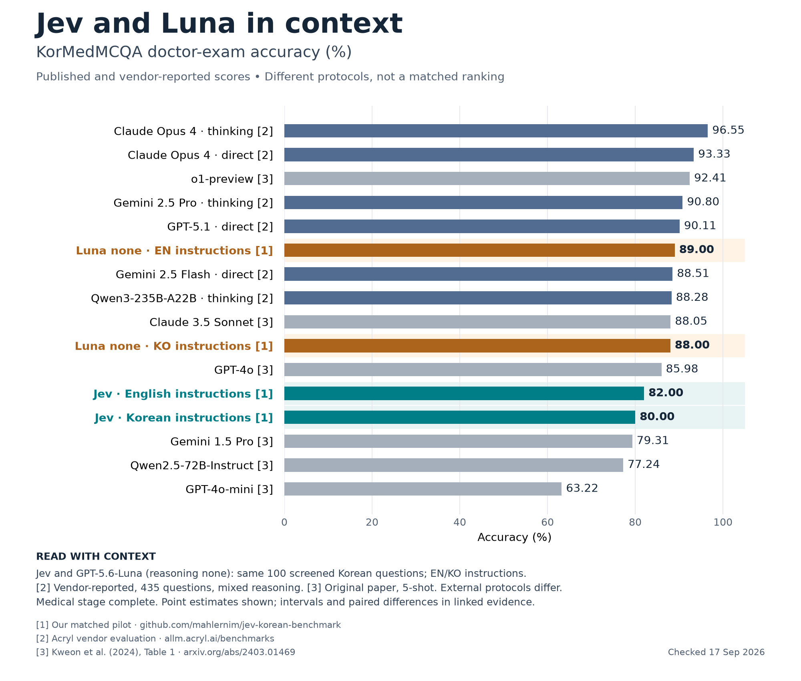

# Jev and Luna in context

[PNG](figures/kormedmcqa-context.png) · [SVG](figures/kormedmcqa-context.svg) · [PDF](figures/kormedmcqa-context.pdf) · [Main report](index.html)

This is a contextual comparison, not a matched ranking of all models. Jev and GPT-5.6-Luna with reasoning `none` used the same 100 screened Korean doctor-exam questions. English and Korean refer to instruction language. Luna scored 89/100 with English instructions and 88/100 with Korean instructions, versus Jev's 82/100 and 80/100. Luna's medical stage has 200 successful responses, zero failures and zero pending. The full Luna experiment has also completed.

Acryl reports the full 435-question doctor test with the reasoning settings shown. Historical scores come from the original paper's doctor column, using its 5-shot protocol. No external comparator was rerun for this graphic. Confidence intervals are omitted from the compact graphic. The [Luna stage-2 evidence](https://github.com/mahlernim/jev-korean-benchmark/blob/main/results/infographic-luna-stage-2.json) retains Wilson intervals and descriptive paired bootstrap intervals. Luna minus Jev is +7 percentage points (95% interval 0 to 14) with English instructions and +8 (2 to 15) with Korean instructions. These small-sample intervals are unadjusted for multiple comparisons.

Sources checked September 17, 2026

1. [Our matched pilot](https://github.com/mahlernim/jev-korean-benchmark), Jev results in `results/stage-2.json` and Luna medical-stage snapshot in `results/infographic-luna-stage-2.json`. Luna model alias `gpt-5.6-luna`, reasoning `none`, decision-only output. The minimal response schema differs between providers.
2. [Acryl benchmark page](https://allm.acryl.ai/benchmarks), KorMedMCQA-435 section. These are vendor-reported results, not independently reproduced here. Only the explicit doctor-test rows are used. The page's separate historical summary includes cross-profession averages and is not used.
3. [Kweon et al., KorMedMCQA, Table 1 and Appendix C](https://arxiv.org/html/2403.01469v3#S4.T1). Doctor-column scores, not the weighted overall average. GPT-4o is the August 2024 version; Claude 3.5 Sonnet is the October 2024 version.

Rebuild without API calls using `python -m jevbench.comparison_infographic`. The source script retains the exact plotted values and source IDs.
