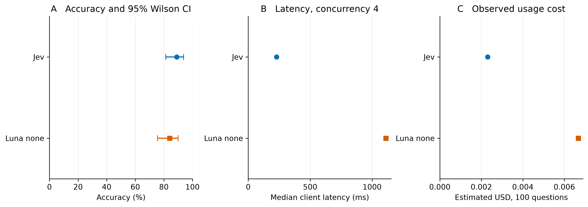

# Original-English MedQA comparison

## Abstract

On 100 matched original-English four-option MedQA test questions, Jev scored 89/100 and Luna-none scored 84/100. Luna minus Jev was -5 percentage points, with a paired 95% bootstrap interval from -11 to +0. This is an exploratory benchmark estimate, not clinical validation or a controlled language comparison.

**Figure 1.** Both models receive the same 100 questions and four original options. Accuracy bars are Wilson 95% intervals. Latency and token cost are observed point estimates from four concurrent requests per provider. They do not describe the earlier sequential experiments.

## Data and methods

[MedQA](https://github.com/jind11/MedQA) contains original English USMLE-style questions. We used the four-option test split via a [pinned documented mirror](https://huggingface.co/datasets/GBaker/MedQA-USMLE-4-options). Source provenance, revision, SHA256, row IDs and selection rules are preserved in the downloadable evidence. Byte identity with the primary Google Drive release was not independently verified.

The source contains 1273 rows. Conservative screening excluded 128, leaving 1145 eligible rows. Selection uses seed 20260917, preserving A-D order and original answer keys. The rejected v1 sample had missing visual references missed by its initial automated screen. An expanded screen produced v2; independent review found two further incomplete stems. Final v3 retains 98 reviewed items and replaces those two using a frozen seeded rule. Neither rejected version was scored. Every final input was checked through independent AI-assisted, gold-blinded review. This checks input completeness, not clinical correctness or gold-label validity; nonblocking source wording and unit issues remain documented.

Both models receive the same English question, options and instruction to select the single best answer. Gold answers are excluded from inputs. Jev uses Choice; Luna uses the Responses API with reasoning effort none, standard service and a strict decision-only JSON schema capped at 128 output tokens. No retrieval, tools or explanations are requested. Jev supplies probabilities natively. We do not fabricate comparable probabilities for Luna.

The full 200-request manifest was frozen before inference. Four worker threads per provider run contemporaneously in separate pools, with a shared $0.25 estimated-spend ceiling that reserves in-flight costs. The first five items per provider form the initial ten-call usage check and remain part of the frozen score. There is no post-result prompt tuning. At most two transient retries are retained; fatal validation or model changes stop new admissions while already admitted calls may finish.

Accuracy is correct/planned, with terminal failures counted as incorrect if present. Valid-response accuracy is also retained. Paired item bootstrap intervals use 4,000 resamples and the fixed seed. The discordance table and two-sided exact McNemar test are descriptive, without multiplicity adjustment. Small pilot intervals do not establish equivalence.

## Results

| Model | Correct / planned | Accuracy (95% CI) | Attempts | Terminal failures |
|---|---:|---:|---:|---:|
| Jev | 89/100 | 89% (81.4%, 93.7%) | 100 | 0 |
| Luna none | 84/100 | 84% (75.6%, 89.9%) | 100 | 0 |

| Paired correctness | Luna correct | Luna incorrect |
|---|---:|---:|
| Jev correct | 82 | 7 |
| Jev incorrect | 2 | 9 |

Two-sided exact McNemar p = 0.1797. The direction of the point estimate should not be treated as an established model ranking.

## Parallel timing and cost

| Model | Median / p95 latency, ms | Sum of call seconds | Sum of active spans, seconds | Valid responses per active second | Estimated USD | Input / output tokens |
|---|---:|---:|---:|---:|---:|---:|
| Jev | 229 / 664 | 28.77 | 7.50 | 13.33 | 0.002305 | 54,870 / 4,500 |
| Luna none | 1111 / 2378 | 129.60 | 33.52 | 2.98 | 0.006676 | 26,178 / 1,200 |

Combined invocation wall time was 33.84 seconds. It includes both providers running concurrently, initialization, persistence, retry delays and closure, but excludes preparation, review and human gaps. Summed call duration is not elapsed batch time. Provider active spans run from the first to last recorded request within each invocation, then sum across invocations.

Per-call latency wraps network calls, decoding and answer validation. Dispatch and initialization wait are recorded separately. Concurrent measurements reflect contention, provider limits and shared client/network conditions. Do not compare their batch elapsed time with the previous concurrency-one experiment or interpret the difference as a model speed improvement.

Costs use reported provider-specific tokens at $0.042/million Jev input tokens, output free, and $0.20/million Luna input, $0.02 cached input and $1.20 output. These are published-price estimates, not invoices. Unknown-usage failures retain conservative reservations in the ledger.

## Relation to the Korean results

The Korean KorMedMCQA pilot and this original-English MedQA sample are different item sets. They differ in curriculum, difficulty, selection and number of options. A model ranking reversal across them would be a task-specific finding, not proof that English caused it. Do not subtract the two benchmark accuracies to estimate a language effect or pool them into one medical score.

The observed point estimates do reverse: Korean KorMedMCQA with Korean instructions was Jev 80% versus Luna 88%, while this English MedQA sample is Jev 89% versus Luna 84%. The English paired interval includes zero, and the independent question sets prevent attributing that reversal specifically to language.

Public benchmark training exposure is unknown. Source screening affects representativeness. Historical examination answers were preserved. This pilot evaluates multiple-choice benchmark performance, not diagnostic safety or clinical readiness.

[Public evidence](https://github.com/mahlernim/jev-korean-benchmark/tree/main/results/medqa-english-v3) · [Korean comparison](luna-comparison.html) · [Main report](index.html)
